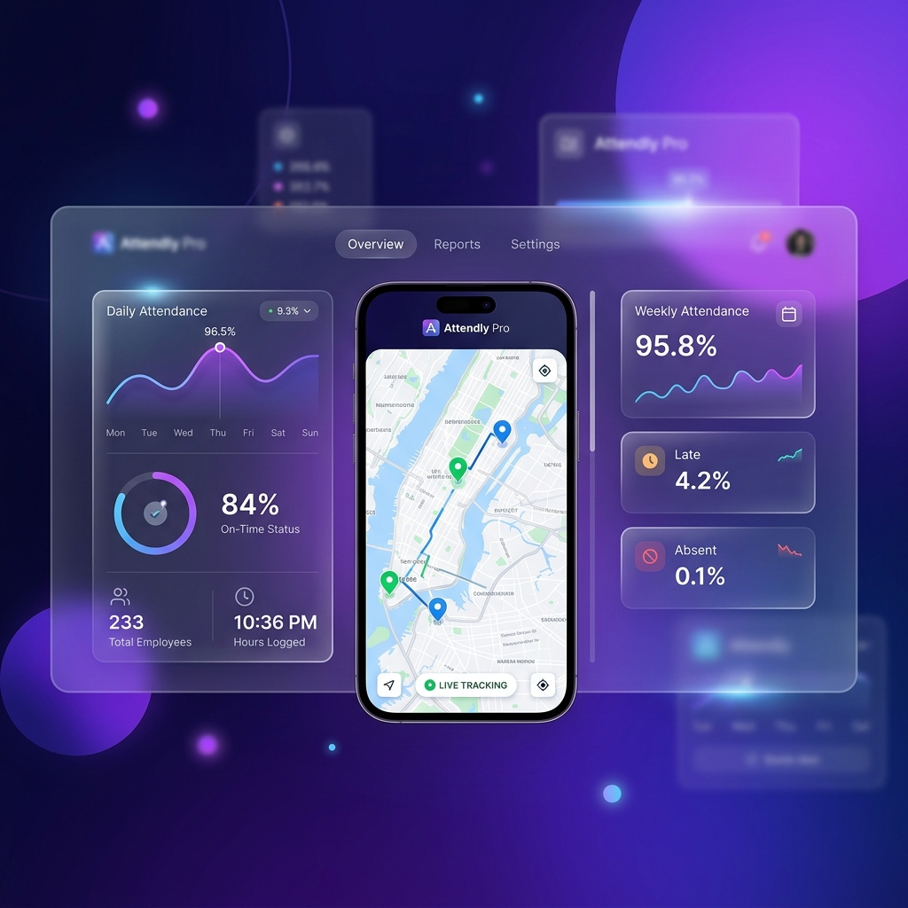

# 🌟 Attendly Pro: The Ultimate Workforce Management Ecosystem



**Attendly Pro** is a premium, high-performance attendance and field workforce management platform. Engineered for the modern distributed workforce, it goes far beyond simple clock-ins to provide a complete, interconnected suite for HR, payroll, and team management.

---

## ✨ Comprehensive Feature Breakdown

### 📸 AI-Powered Face Recognition Attendance
*The ultimate defense against buddy-punching and time theft.*
- **Biometric Verification**: Users must verify their identity using real-time facial recognition via `face-api.js` before marking attendance.
- **Admin Enrollment**: To ensure security, face descriptors can only be registered and approved by an Administrator during the onboarding process.
- **Liveness Detection**: Ensures that a real person is present, combining facial vectors with timestamp and location data.

### 📡 Real-Time Field Tracking & Geospatial Intelligence
*Complete visibility into your mobile workforce.*
- **Live Interactive Maps**: The Field Tracking dashboard uses Leaflet to plot staff locations on a live map in real-time.
- **Background Synchronization**: High-frequency GPS updates (every 30 seconds) run silently in the background while the app is open.
- **Device Health Telemetry**: Managers can see not just where their staff are, but also their device battery level and speed.
- **Smart Geofencing fallback**: If GPS is unavailable, the system intelligently defaults to the user's assigned Branch coordinates to ensure continuity.

### 🏢 Multi-Branch & Geofence Management
*Built for organizations with multiple offices or sites.*
- **Branch Contextualization**: Create distinct branches with their own coordinates (Latitude/Longitude) and geofence radii (e.g., 150 meters).
- **Location-Restricted Attendance**: Staff can be restricted to only mark attendance when physically within the radius of their assigned branch.

### 🗓️ Advanced Leave & Comp-Off Management
*Streamlined workflows for time-off.*
- **Leave Categories**: Support for Annual, Sick, Casual, and Unpaid leaves, with trackable annual allowances.
- **Approval Workflows**: Employees request leaves; Managers and Admins receive them in a clean queue for instant approval or rejection.
- **Compensatory Offs (Comp-Offs)**: Dedicated workflow for employees working on holidays or weekends to claim compensatory time off, fully integrated into the balance system.

### 🕒 Dynamic Shift Scheduling
*Handling complex operational timings effortlessly.*
- **Admin Scheduling Engine**: Assign specific shift timings to individuals or entire branches.
- **Employee Visibility**: Staff can view their upcoming shifts directly on their dashboard and calendar.
- **Late Thresholds**: Automatically flag attendance records as "Late" based on dynamic shift start times and organization-wide grace periods.

### 💰 Automated Payroll & Payslip Generation
*Turn attendance data into actionable financials.*
- **Automated Calculation**: The system aggregates Present Days, Approved Leaves, Holidays, and deductions to calculate net payable days.
- **One-Click Payslips**: Generate professional, formatted PDF payslips instantly for any given month.
- **Role-Based Salary Base**: Flexible architecture to accommodate different compensation tiers.

### 🌍 Deep Localization (India-Optimized)
*Built for the nuances of the Indian workplace.*
- **Timezone Locking**: All data is strictly normalized to Indian Standard Time (`Asia/Kolkata`), preventing drift across devices.
- **Holiday Engine**: Built-in Gazetted and Restricted holiday calendars. Admins can easily toggle which holidays apply to which branches.
- **Format Standards**: Currency defaults to ₹ (INR), and dates follow the DD/MM/YYYY standard.

### 📊 Comprehensive Reporting & Dashboards
*Data-driven decision making at a glance.*
- **Executive Dashboard**: High-level metrics on today's attendance, pending approvals, and active field staff.
- **Exportable Reports**: Detailed tabular data ready for audit or export, filtering by date ranges, branches, and specific employees.

### 🛡️ Enterprise-Grade Security & Roles (RBAC)
- **Three-Tier Architecture**: Distinct interfaces and capabilities for **Employees**, **Managers**, and **Admins**.
- **Dual-Mode Login**: Use standard Supabase Auth, or utilize our Custom Login engine for rapid field deployments without complex email confirmations.
- **Database Hardening**: Built on PostgreSQL with Row Level Security (RLS) and Security Definer RPCs to ensure data is never leaked or tampered with.

---

## 🛠️ Technology Stack

| Layer | Technology |
| :--- | :--- |
| **Frontend** | React 18, TypeScript, TanStack Router |
| **Backend** | Supabase (PostgreSQL, Auth, Realtime) |
| **Styling** | Tailwind CSS, Framer Motion, shadcn/ui |
| **Maps & AI** | Leaflet.js, face-api.js |
| **Hosting** | Render / Netlify (CI/CD Optimized) |

---

## 🚀 Quick Start Guide

### 1. Installation
```bash
git clone <repository-url>
cd attendance-hub-pro-main
npm install --legacy-peer-deps
```

### 2. Environment Configuration
Create a `.env` file in the root:
```env
VITE_SUPABASE_URL=your_project_url
VITE_SUPABASE_ANON_KEY=your_anon_key
```

### 3. Database Initialization
Apply the schema found in `supabase_schema.sql` to your Supabase project using the Supabase SQL Editor. This provisions all tables, functions, and initial configuration data.

### 4. Development Server
```bash
npm run dev
```

---

## 📄 License & Support
This project is licensed under the MIT License.
For database configuration issues or setup help, please see [SUPABASE_SETUP.md](./SUPABASE_SETUP.md).

---
*Built with ❤️ by Nikhil Dath.*